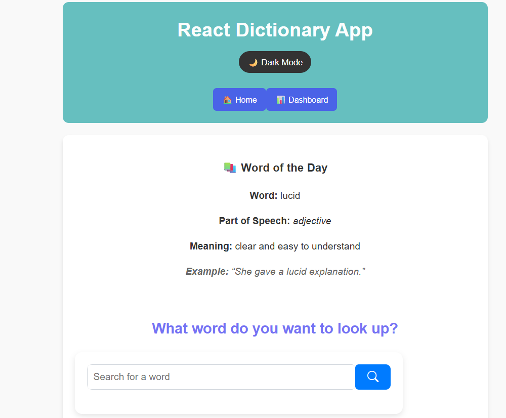
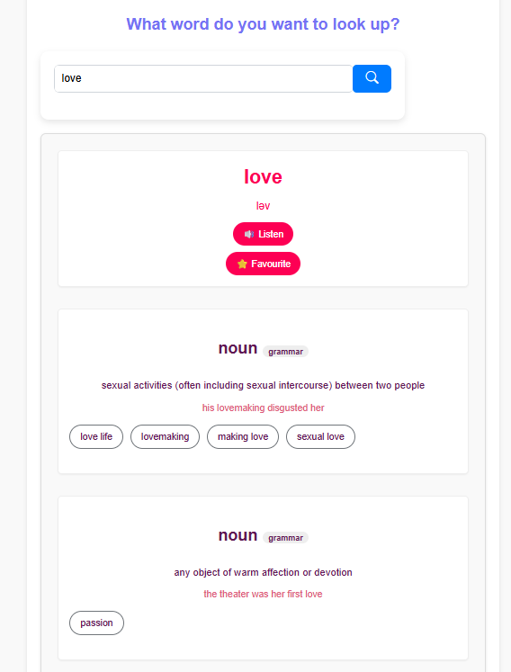
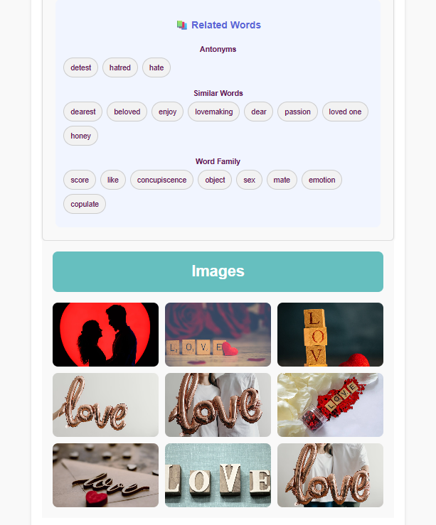
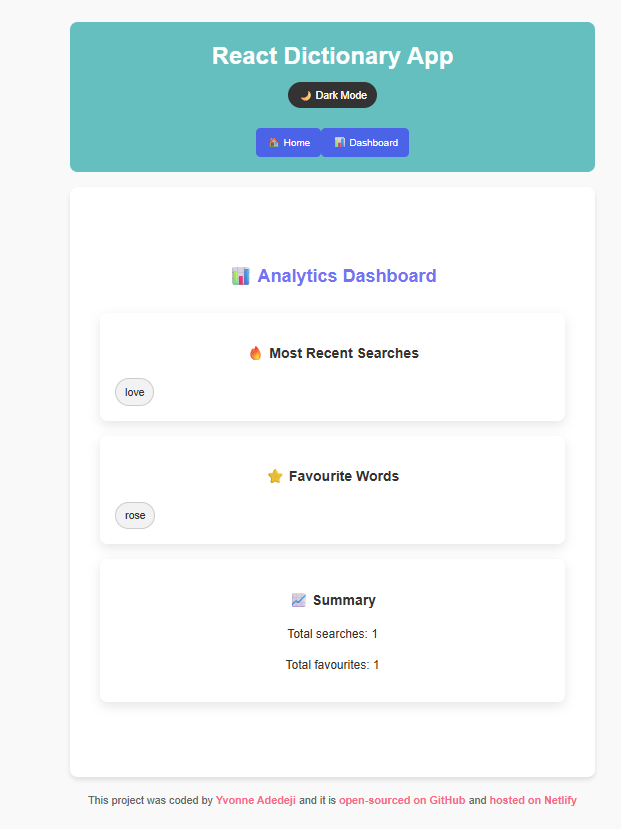
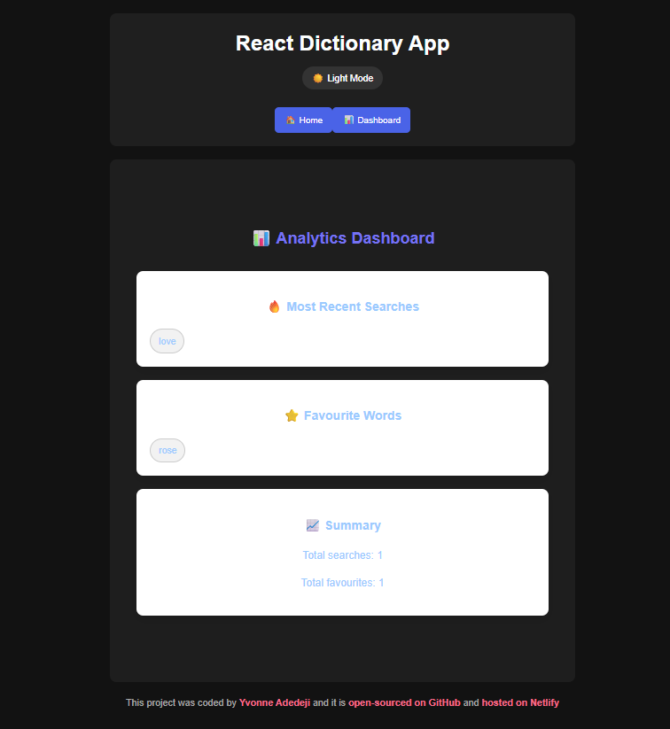

# react-dictionary-app

## 📌 Description
The React Dictionary App is an interactive vocabulary and language-learning web application built with React.js. It allows users to search for word meanings, phonetics, examples, synonyms, and related images in real time.

The app also includes smart features like recent searches, favourites, analytics tracking, and a Word of the Day system to enhance vocabulary learning.

## 🛠 Prerequisites
* A modern web browser (Chrome, Firefox, Safari, Edge)
* Internet connection to fetch data from the APIs

## 📋 Features
Core App Features
* Single Page Application (SPA) built with React
* Component-based architecture (modular reusable components)
* Client-side rendering with ReactDOM
* Page navigation (no routing library) using state (home vs analytics)
* Responsive layout using CSS & media queries

Dictionary Functionality
* Word search input (controlled component)
* Form submission handling
* Live API search requests

Dictionary data display
* Word
* Phonetics
* Meanings
* Examples
* Synonyms

* Error handling (word not found / API failure)
* Loading spinner UI
* Toast notifications for feedback

API Integrations
* Dictionary API (SheCodes API) for definitions
* Image API (SheCodes Images API) for related images

Datamuse API for:
* Antonyms
* Similar words
* Word families

* Parallel API calls using Promise.all
* Axios for HTTP requests

Image Features
* Image search based on keyword
* Image deduplication logic
* Grid layout display
* Lightbox modal viewer
* Click-to-enlarge functionality
* Image descriptions (alt text)
* Limit of max images (performance optimization)

Audio & Accessibility

Speech synthesis (Text-to-Speech) using:
* Browser Web Speech API

* British pronunciation (en-GB)
* Adjustable speech rate
* Accessible interactive buttons

## 💻 Technologies Used
The application is built with the following technologies:
* HTML
* CSS
* JavaScript
* React.js
* Axios (for API requests)
* SheCodes Dictionary API
* SheCodes Images API
* Datamuse API
* LocalStorage 
* Bootstrap Icons

## 🚀 Installation
No installation is required to use the app. It is hosted online and can be accessed via a web browser.

## 📚 Usage
1. Open the application in your browser.
2. Enter a word in the search bar
3. Press Enter or click search
4. Explore:
* Definitions
* Pronunciation
* Examples
* Synonyms
* Related images
* Analytics & history

## 🔗 Live Demo & Repository
Application can be viewed here: 
* 🌐 Live: https://ya-react-dictionary-app.netlify.app/
* 💻 Repository: https://github.com/yvonnesarah/react-dictionary-app

## 🖼 Screenshot(S)
Before Design

React Dictionary App

After Design

React Dictionary App

React Dictionary App - Love Example

React Dictionary App - Love Example

React Dictionary App - Analytics

React Dictionary App Analytics - Dark Theme

## 🗺️ Roadmap (Planned Features)
User Interaction Features
* Add/remove favourites ✅
* Recently searched words tracking ✅
* Click to re-search previous words ✅
* Clear recent searches button ✅
* Persistent user data ✅

Local Storage (Persistence)

Stores:
* Recent searches ✅
* Favourite words ✅
* Word of the Day ✅

* Data retrieved on app load (useEffect) ✅
* JSON parsing/stringifying ✅

Analytics Dashboard

Displays:
* Most recent searches ✅
* Favourite words ✅

Summary stats:
* Total searches ✅
* Total favourites ✅

* Grid/pill UI for words ✅

Word of the Day Feature
* Random word generator from static dataset ✅
* Daily persistence using date check ✅
* Stored in localStorage ✅

Includes:
* Word ✅
* Meaning ✅
* Part of speech ✅
* Example ✅

Related Words System

Categorized display:
* Antonyms ✅
* Similar words ✅
* Word family ✅

* UI grouping with limits (max 8 per category) ✅
* Clean pill-based UI ✅

## 🚀 Upcoming Features
UI / UX Features
* Clean card-based design ✅
* Pill-style word tags ✅
* Hover effects & animations ✅
* Lightbox overlay ✅
* Toast messages ✅
* Loading spinner animation ✅
* Button interactions & feedback ✅

Theme System
* Light / Dark mode toggle ✅
* Theme stored in state ✅
* Applied globally via document.body.className ✅
* Dark mode overrides in CSS ✅

React Concepts Used
* useState (state management) ✅
* useEffect (side effects & lifecycle) ✅
* useCallback (memoized functions) ✅
* Conditional rendering ✅
* Props drilling ✅
* Event handling ✅
* Controlled inputs ✅
* Array mapping for UI rendering ✅

Component Structure
* App (root) ✅
* Dictionary (main logic) ✅
* Results ✅
* Meaning ✅
* Synonyms ✅
* RelatedWords ✅
* Photos ✅
* RecentlySearched ✅
* Favourites ✅
* WordOfTheDay ✅
* AnalyticsDashboard ✅

Performance & Optimization
* API calls executed in parallel ✅
* Image deduplication ✅
* Data slicing (limit items shown) ✅
* Conditional rendering to avoid unnecessary DOM updates ✅

## 🧠 Advanced Features (Professional Level)
SEO & HTML Features
Meta tags:
* Description ✅
* Keywords ✅
* Author ✅
* Theme color ✅

* Responsive viewport settings ✅
* Favicon ✅
* Google Fonts (Poppins) ✅
* Bootstrap Icons CDN ✅

Styling & Design
* Modular CSS files per component ✅
* Flexbox & CSS Grid layouts ✅
* Responsive design (mobile/tablet) ✅
* Animations (spinner, toast fade) ✅
* CSS variables (for theme adaptability) ✅

Error Handling & Edge Cases
* Empty state handling (no results, no favourites) ✅
* API failure fallback ✅
* Invalid word handling ✅
* Safe JSON parsing (try/catch) ✅
* Guard clauses in functions ✅

Accessibility & UX Enhancements
* Keyboard focus styles ✅
* Button semantics ✅
* Alt text for images ✅
* Clear feedback (loading, errors) ✅

## 🧠 Challenges & Learnings
🚧 Challenges Faced

1. Managing multiple API integrations
The app uses multiple APIs (dictionary, images, and Datamuse). Coordinating all asynchronous requests with Promise.all() while handling failures gracefully was initially complex.

2. State synchronization with localStorage
 Keeping recent searches and favourites in sync between React state and localStorage required careful handling to avoid stale or duplicated data.

3. Handling missing or invalid API responses
Some words return incomplete or inconsistent data, so defensive checks were added to prevent crashes and improve UX.

4. Light/Dark theme implementation
Ensuring consistent styling across many components in both themes required overriding multiple CSS rules and testing across views.

5. Lightbox image gallery behavior
  Implementing a smooth image preview experience while preventing event bubbling issues (click-to-close vs click-inside) was tricky.

📚 Key Learnings

1. Improved understanding of React hooks (useState, useEffect, useCallback) in real-world state management.
2. Gained experience working with multiple APIs in parallel using Promise.all().
3. Learned how to persist user data using localStorage effectively.
4. Strengthened skills in component-based architecture and reusable UI design.
5. Improved ability to structure a medium-sized React project with clear separation of concerns.
6. Gained confidence in handling UI/UX edge cases like loading states, empty states, and error states.

## 👥 Credit
Designed and developed by Yvonne Adedeji. 

Powered by:

* SheCodes Dictionary API
* SheCodes Images API
* Datamuse API

## 📜 License
This project is open-source. For licensing details, please refer to the LICENSE file in the repository.

## 📬 Contact
You can reach me at 📧 yvonneadedeji.sarah@gmail.com.
