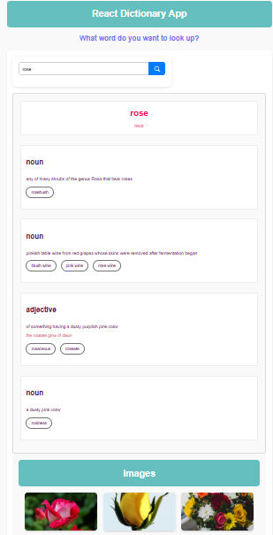

# react-dictionary-app

## 📌 Description
The React Dictionary App is a simple and interactive web application built with React.js that allows users to search for word definitions, phonetics, examples, synonyms, and related images.

The application integrates external APIs to deliver real-time dictionary data and visual context for searched words, creating an informative and engaging user experience.

## 🛠 Prerequisites
* A modern web browser (Chrome, Firefox, Safari, Edge)
* Internet connection to fetch data from the APIs

## 📋 Features
* 🔎 Word Search – Search for any word and view its definition using the SheCodes Dictionary API.
* 🔊 Phonetic Pronunciation – Displays phonetic spelling and pronunciation.
* 📖 Word Meanings – Shows detailed meanings and explanations.
* 💡 Example Sentences – Provides example usage of the word.
* 🔗 Synonyms – Helps users discover similar words.
* 🖼 Related Images – Displays images related to the searched word.
* 📱 Responsive Design – Works well across desktop, tablet, and mobile devices.

## 💻 Technologies Used
The application is built with the following technologies:
* HTML
* CSS
* JavaScript
* React.js
* Axios (for API requests)
* SheCodes Dictionary API
* SheCodes Images API

## 🚀 Installation
No installation is required to use the app. It is hosted online and can be accessed via a web browser.

## 📚 Usage
1. Open the application in your browser.
2. Enter a word in the search box and press enter.
3. View word definitions, phonetics, examples, and synonyms.
4. See related images for the searched word.

1. Open the application in your browser.
2. Enter a word into the search input.
3. Press Enter or click the search button.
4. View the word’s: Definition, Phonetics, Example sentences, Synonyms, Related images

## 🔗 Live Demo & Repository
Application can be viewed here: 
* [Live](https://ya-react-dictionary-app.netlify.app/)

* [Repository](https://github.com/yvonnesarah/react-dictionary-app)

## 🖼 Screenshot(S)
Before Design

React Dictionary App

## 👥 Credit
Designed and developed by Yvonne Adedeji. 

Dictionary and image data powered by SheCodes Dictionary API and SheCodes Images API

## 📜 License
This project is open-source. For licensing details, please refer to the LICENSE file in the repository.

## 📬 Contact
You can reach me at 📧 yvonneadedeji.sarah@gmail.com.
